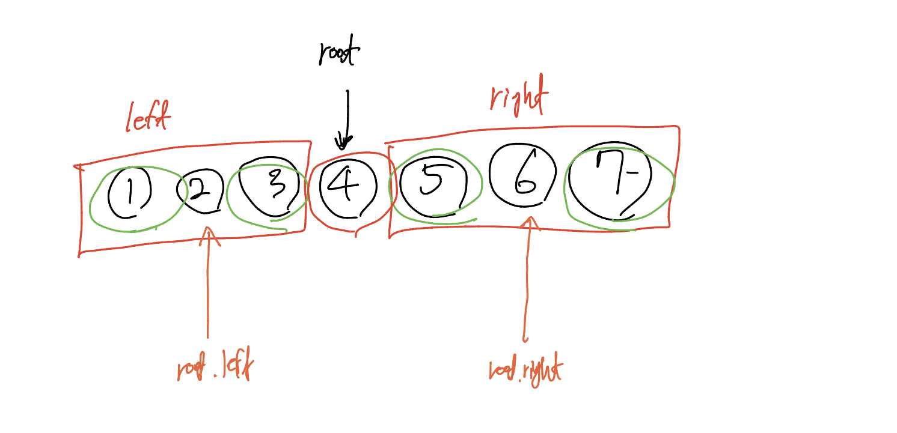

### 제한 사항

- 주어지는 숫자의 길이 10만
  
## 문제 해결 전략

- 가상 더미 노드를 생성해서 포화 이진트리를 만들고 그것을 이진수와 비교한다

1. number를 2진수로 바꾼다.
2. number의 길이가 2^n -1로 맞춘다
   1. 포화 이진 트리의 갯수는 2^n - 1이다.
   2. 2^n -1 갯수에 맞지 않은 경우 2^(n+1) -1 길이에 맞춰서 0을 좌측에 패딩한다.
3. 만들어진 이진수를 부모 노드가 더미, 자식 노드가 실제하는 경우 false 리턴
   1. 나머지의 경우는 true
   2. inorder 방식
   3. inorder의 가운데 인덱스는 상위 노드, left, right는 상위 노드를 제외한 인덱스
   4. left, right 범위 내에서 다시 iii와 똑같이 찾는다.
   5. 이 과정에서 left, right, parent 3개의 상위 노드를 재귀적으로 구할 수 있다.

inorder traverse 배열 트리 노드를 재귀적으로 구하는 과정